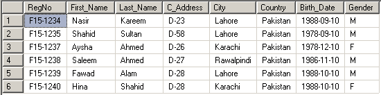

# Labs
### Lab-1:
1. Write SQL statements to create a table name “STUDENT” of following table and insert data shown below.
   
      
2. Write SQL statements to insert seven more records into same table and also attach printed output of table.
3. Write SQL statements to view all entries in the table and also attach printed output of table.
### Lab-2:
1. Create a table called EMPLOYEE table with the following structure and allow NULL for all columns except EMPNO, ENAME, DOJ and JOB.

            Name 	|	Type
            -------------------------
            EMPNO 	|	NUMBER(6)
            ENAME	|	VARCHAR2(10)
            GENDER	|	CHAR(1)
            DOJ	|	DATE
            JOB	|	VARCHAR2(30)
            MGR	|	NUMBER(4)
            DEPTNO 	|        NUMBER(3)
            SAL	|	NUMBER(7,2)
2. Add two columns Commission and HireDate to the EMPLOYEE table. Commission is a decimal type and can be NULL.
3. Modify the column width of the JOB field of EMPLOYEE table with VARCHAR(50).
4. Write a query to drop a column DOJ to the EMPLOYEE table.
### Lab-3:
1. Create DEPARTMENT table with the following structure and set the DEPTNO as primary key and DNAME is unique key.

            Name	 |	Type
            -------------------------
            DEPTNO	 |	NUMBER(2)
            DNAME	 |	VARCHAR2(10)
            LOCATION	 |	VARCHAR2(10)
            ESTABLISHED |	DATE
2. Write a query to add constraints to the EMPLOYEE table that EMPNO as the primary key and DEPTNO as the foreign key.
3. The Company wants to set 3000 as a min salary of employee. You are required to write a query to add suitable constraint to the EMPLOYEE table.

